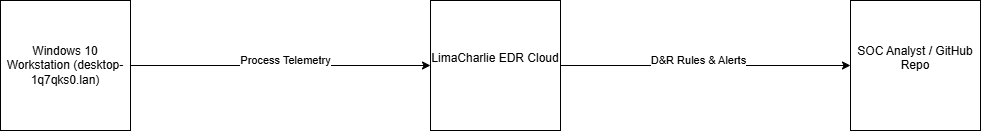

# LimaCharlie EDR Setup & Telemetry Analysis Lab

## Objective
This project demonstrates the deployment, configuration, and telemetry validation of the **LimaCharlie Endpoint Detection and Response (EDR)** agent on a Windows host. The goal is to capture live process creation telemetry and construct custom Detection & Response (D&R) rules for Threat Hunting and SOC monitoring.

## System Architecture & Details
* **EDR Agent:** LimaCharlie Sensor v5.3.12 (64-bit)
* **Endpoint Host:** Windows 10 (desktop-1q7qks0.lan)
* **Deployment Method:** Administrative PowerShell CLI
* **SIEM / Telemetry Transport:** Real-time SaaS Cloud Streaming

## Lab Execution & Implementation

### 1. Agent Deployment & Service Verification
The LimaCharlie sensor was installed via PowerShell running as Administrator using the organization installation key. Verification was confirmed by inspecting the running service state.

### 2. Telemetry Capture & Analysis
Live process creation telemetry (NEW_PROCESS) was validated on the host through test executions:
* **Command Executions Observed:** whoami, cmd.exe, 
otepad.exe
* **Telemetry Fields Analyzed:**
  * Process ID (PID)
  * Parent Process ID (PPID)
  * Executable path (C:\Windows\System32\whoami.exe)
  * CODE_IDENTITY executable hashes

### 3. Detection & Response (D&R) Engineering
A custom D&R rule was engineered to detect unapproved binary executions by matching process creation event paths and triggering real-time alerts within the telemetry pipeline.

## Verification & Key Findings
* EDR sensor maintains continuous low-latency streaming to the SaaS cloud controller.
* Event timeline correctly correlates parent-child process trees (powershell.exe -> cmd.exe -> whoami.exe).

